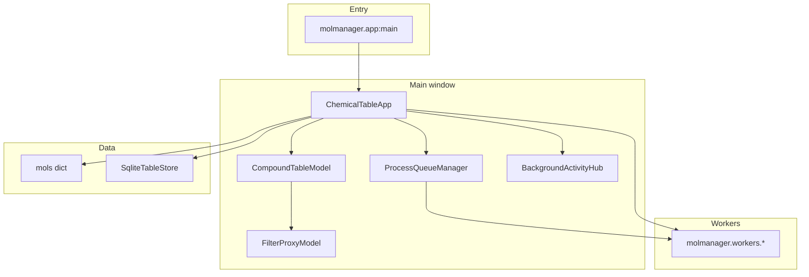

# MolManager architecture

Desktop chemistry table manager: **PyQt5** UI, **RDKit** structures, optional **PyTorch** tools (pKa, permeability).

## High-level layout

## Main window (`molmanager/ui/main_window/`)

`ChemicalTableApp` composes mixins (multiple inheritance):

| Mixin | Responsibility |
|--------|----------------|
| `SessionMixin` | Open/save `.cms` sessions, CSV session import |
| `TableUIMixin` | Selection, search, column UI, `clear_all` |
| `IngestExportMixin` | File/SQL ingest, export |
| `ChemistryMixin` | Tools menu: descriptors, conformers, render, filters prep, SQLite rebuild |
| `ClusterMixin` | Clustering dialogs |
| `DimensionReductionMixin` | PCA / t-SNE / UMAP docking |
| `MedChemSpaceMixin` | MedChem space plot |
| `QsarMixin` | QSAR entry points |
| `GuiSettingsMixin` | Persisted UI settings |

**Note:** `ChemistryMixin` is large; future splits could move prepare/render/predict groups into separate mixins without changing behavior.

## Table and visibility

- **Source of truth:** `CompoundTableModel` (`_rows`, OIDs, batched `dataChanged`).
- **Filtered view:** `FilterProxyModel` hides rows by OID set (`set_visible_oids`), not per-row `setRowHidden`.
- **Selection:** Qt selection + `_selected_oids_override` for large selections (tools/plots use `_selected_oids_set()`).
- **SQLite mirror:** `SqliteTableStore` powers text/numeric filter pushdown and column search at 100k+ rows. Rebuilt in chunks on the GUI thread, then `SqliteRebuildWorker` builds the DB file.

## Background work

| Mechanism | Used for |
|-----------|----------|
| `ProcessQueueManager` | Serial heavy tools (descriptors, cluster, export, …) |
| `threadpool` | Substructure filter, dimred, MedChem space, SQLite export chunks |
| `_render_threadpool` | 2D structure rendering |
| `_background_jobs` + `BackgroundActivityHub` | **Processes** dialog rows for non-queue work |

Progress: `WorkerSignals.tool_progress` + `ToolProgressState` polling → bottom `status_label`.

## Plots and table sync

- **Plotter:** `ui/plot.py` (`PlotWidget`)
- **PCA / radar / dimred:** `ui/plotly_interactive_view.py`
- **Shared helpers:** `ui/plot_table_sync.py` (selection mapping, clear override)
- **Table → plot:** debounced `_schedule_sync_active_plots_from_table_selection`
- **Plot → table:** `apply_table_selection_for_source_rows`
- **Filters / edits:** `_schedule_active_plots_replot` after filter apply; `dataChanged` on model for open plots

## Adding a new Tool

1. Dialog under `molmanager/ui/dialogs/` (use `scope.selection_scope_checked`, `parent_app` on docked panels).
2. Worker under `molmanager/workers/` if work is heavy.
3. Wire menu action in `chemical_table_app.py` / `chemistry_mixin.py`.
4. Long jobs: `process_queue.enqueue` + `_begin_tool_progress` / `report_tool_progress`.
5. Short threadpool jobs: `register_background_job` / `unregister_background_job`.
6. Tests under `tests/` (unit tests avoid full GUI where possible).

## Related docs

- [STEREO_AND_ISOMERISM.md](STEREO_AND_ISOMERISM.md)
- [VALENCE_BONDS_AND_AROMATICITY.md](VALENCE_BONDS_AND_AROMATICITY.md)
- [PACKAGING.md](PACKAGING.md)
